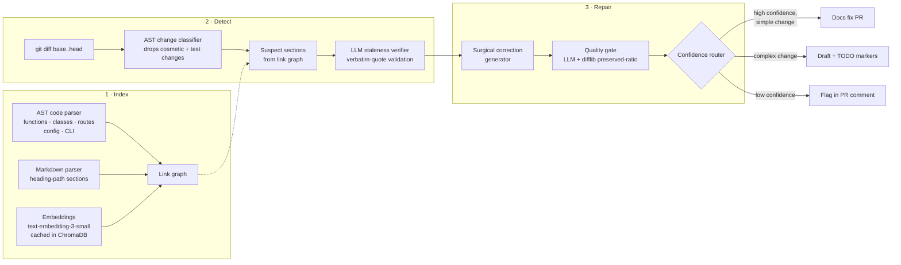

# 🩺 doc-sentinel — Self-Healing Technical Documentation

Every team's docs are perpetually stale. Code changes ship daily; nobody
re-reads the docs to check what those changes silently broke. doc-sentinel is
a GitHub Action that closes that loop: on every pull request it detects which
documentation sections the code changes made inaccurate, **auto-fixes the
high-confidence drift in a docs PR**, and flags the rest for human review —
with a single summary comment on the triggering PR.

```text
🩺 Doc Check Results: 3 section(s) verified accurate, 1 auto-fixed (see PR #42), 2 flagged for review
```

## Quickstart (60 seconds)

Add `.github/workflows/doc-sentinel.yml` to your repo:

```yaml
name: doc-sentinel
on:
  pull_request:
    paths: ["**/*.py"]

permissions:
  contents: write
  pull-requests: write

jobs:
  doc-check:
    runs-on: ubuntu-latest
    steps:
      - uses: actions/checkout@v4
        with:
          fetch-depth: 0   # doc-sentinel diffs base..head
      - uses: abetep/doc-sentinel@v0
        with:
          anthropic-api-key: ${{ secrets.ANTHROPIC_API_KEY }}
          openai-api-key: ${{ secrets.OPENAI_API_KEY }}
```

That's it. Open a PR that renames a parameter your docs mention and watch the
docs-fix PR appear.

## How it works



1. **Index** — the codebase is parsed with Python's `ast` into semantic chunks
   (functions, classes, FastAPI/Flask routes, settings classes, CLI commands),
   docs are split into heading-path sections, and a link graph connects them:
   lexical links for explicit mentions, embedding-similarity links for the
   rest. Embeddings are cached by content hash in file-based ChromaDB, so
   unchanged text is never re-embedded.
2. **Detect** — the PR diff is mapped onto chunks and classified on the AST
   (comment/whitespace/docstring-only changes are provably cosmetic and
   skipped). Linked doc sections become suspects; an LLM verifies each one
   against the old and new code. Every claimed problem must quote the docs
   verbatim — fabricated quotes are rejected and retried, and unverifiable
   sections **fail closed** into human review.
3. **Repair** — a second LLM pass rewrites only the stale spans, a validator
   grades the result (with the "don't touch accurate text" rule enforced
   programmatically via difflib, not prompts), and a confidence router picks
   the mode: auto-fix PR, draft with `TODO(doc-sentinel)` markers, or
   flag-only.

## Measured accuracy

From [`evals/RESULTS.md`](evals/RESULTS.md), 13 labeled cases (including
false-positive probes) on a vendored FastAPI-style project, retrieval stage,
fully offline:

| Metric | Value |
|---|---|
| Recall | **1.00** (no missed stale sections, incl. deleted functions/settings) |
| Precision | **0.83** (2 conservative FPs, both filtered by the LLM verify stage) |
| F1 | **0.91** |

False-positive probes (new endpoint nobody documented, docstring-only change,
private-helper rename) correctly produce zero suspects. Run it yourself:
`python evals/run_evals.py` (offline, no keys) or `--live` for
LLM-verified metrics and rubric-graded corrections.

## Configuration

| Input | Default | Description |
|---|---|---|
| `github-token` | `${{ github.token }}` | Token for PR comments and the docs-fix PR |
| `anthropic-api-key` | — | Required when `llm-provider: anthropic` |
| `openai-api-key` | — | Embeddings; also the LLM when `llm-provider: openai` |
| `llm-provider` | `anthropic` | `anthropic` \| `openai` \| `none` (detect-and-flag only) |
| `embeddings` | `openai` | `openai` \| `none` (lexical links only, zero embedding cost) |
| `confidence-threshold` | `0.8` | Minimum confidence to auto-fix instead of draft/flag |
| `mode` | `fix` | `fix` (open docs PR) \| `flag-only` (comment only) |

Outputs: `stale-count`, `fixed-count`, `flagged-count`, `fix-pr-url`.

## Cost per run

Every run prints its token usage and cost estimate, and the PR comment
includes it. Typical PR (3 changed functions, 2 suspect sections, 1 fix):
2 verify calls + 1 generate + 1 validate ≈ 15–25k tokens ≈ **$0.05–$0.15**
with Claude Sonnet. Embeddings are ~$0.0004 per full index of a 10k-line
repo and near-zero after (content-hash cache).

## Local CLI

```bash
pip install -e ".[runtime]"
doc-sentinel index --repo .                      # build .doc-sentinel/index.json
doc-sentinel check --base-ref origin/main        # what did my branch break?
doc-sentinel repair --report report.json --apply # fix it
```

## Development

```bash
pip install -e ".[dev]"
pytest        # 47 tests, fully offline (LLM calls are mocked)
ruff check src tests && mypy
python evals/run_evals.py
```

## Limitations (honest ones)

- **Python-only code parsing** for now. The doc side is language-agnostic;
  adding a TypeScript parser means implementing one module against the same
  chunk model.
- Staleness verification quality is bounded by the LLM; the fail-closed
  design means uncertainty becomes "please review", never silence.
- Sections that describe *behavior spread across many functions* link via
  embeddings only, which is noisier than explicit mentions.
- Live (LLM-verified) eval numbers require API keys and are not yet included
  in RESULTS.md — the published metrics are the deterministic retrieval stage.

## Publishing to the Marketplace

The Action is marketplace-ready (`action.yml` with branding, semver
`CHANGELOG.md`). GitHub requires a marketplace Action to live at the root of
its own public repository: extract this directory (`git subtree split` or a
fresh repo), push, tag `v0.1.0` + `v0`, then "Publish to Marketplace" on the
release page.
